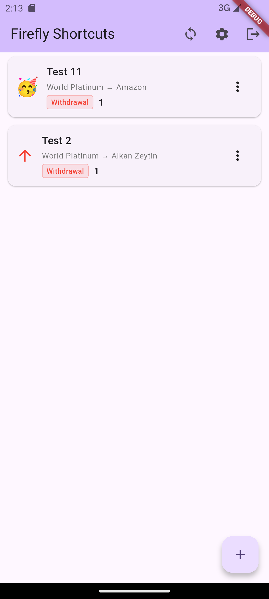
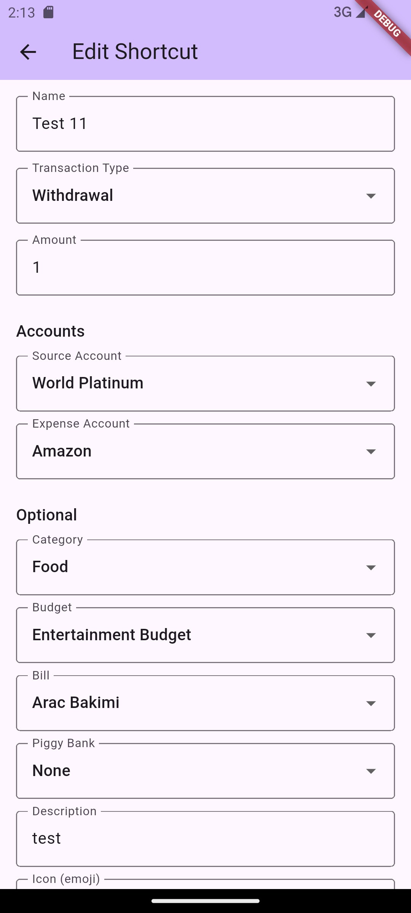
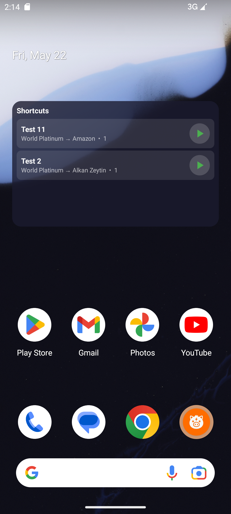
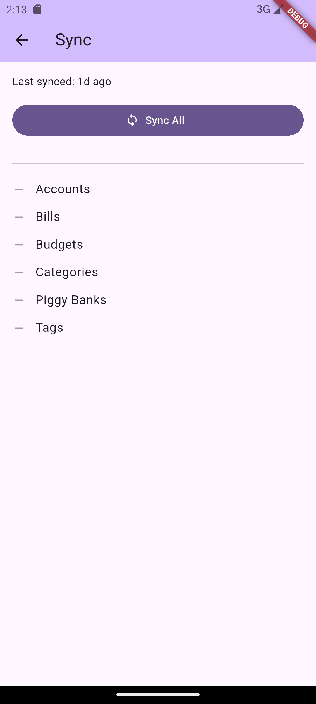

# Firefly Shortcuts

A Flutter Android app for executing preconfigured [Firefly III](https://firefly-iii.org/) transactions directly from your home screen using app shortcuts and widgets.

## Background

[Firefly III](https://firefly-iii.org/) is a powerful open-source self-hosted personal finance manager. It is excellent at tracking your spending, and one of its core strengths is to allow different currency accounts and inter-account transactions between them.

However, adding routine transactions still means opening a browser (or app), navigating to the transaction form, filling in accounts, amounts, and categories, and submitting. For transactions you repeat regularly but not on a fixed schedule or amount (a daily coffee, a recurrent transfer to savings, work-day lunches, etc.), this can be a bit of a hassle.

Firefly Shortcuts solves this by letting you configure those transactins (as `Shortcuts`) once and execute them with a single tap from an Android home screen widget. No navigation, no form-filling, no context switching. 

---

### What it Does

The app has two main parts: a **management interface** and a **home screen widget**.

In the management interface you create *shortcuts* - named, pre-configured transactions. Each shortcut stores everyting Firefly III needs: transaction type, amount, source and destination accounts, and any optional field like category, budget, bill, piggybank, tags, and a description. You sync the app with your Firefly III instance to pull in your accounts and other reference data, and that is about all the setup you need.

The home screen widget lists all your shortcuts. Each one has a play button on the right; tap it and teh transaction is posted to your Firefly III instance in the background. The button moves through a simple state cycle:

- **Play**: ready, tap to execute the transaction.
- **Hourglass**: transaction is being executed, button is disabled.
- **Green check**: transaction executed successfully (returns back to play after five seconds).
- **Gray X**: transaction execution failed (returns back to play after five seconds).

This is the core loop; configure once, tap to transact. 

---

## Screenshots

**Home screen - shortcut list**

**Shortcut editor**

**Home screen widget**

**Account sync screen**

## Installation

The latest release APK can be downloaded from the GitHub releases page. I advise using a tool like [Obtainium](https://obtainium.imranr.dev/) to install any app from a repository release, as it is more reliable and can handle updates. 

For building from source, see [SETUP.md](./SETUP.md).

## First Time Configuration

  On first launch the app will show the settings screen. You need two things:

  Server URL — the base URL of your Firefly III instance, for example https://finance.example.com. Include the scheme (https://) and omit any trailing slash.

  Personal Access Token — generate one in Firefly III under Profile > OAuth > Personal Access Tokens. Give it a descriptive name like Firefly Shortcuts. Copy the token and paste it into the
  PAT field.

  Tap Connect. If the connection succeeds you will be taken to the home screen.

  ---

  ## Syncing Reference Data

  Before you can create shortcuts the app needs to know about your Firefly III accounts, categories, budgets, bills, and piggybanks. Tap the sync button on the home screen to pull this data.
   A full sync is required at least once, and should be run again whenever you add or modify accounts or categories in Firefly III.

  ---

  ## Creating Shortcuts

  Tap the + button on the home screen to open the shortcut editor. The required fields are:

  - Name — displayed on the widget
  - Transaction type — withdrawal, deposit, or transfer
  - Amount
  - Source account and destination account (which accounts are shown depends on the transaction type)

  Everything else (category, budget, bill, piggybank, tags, description) is optional. Save the shortcut and it will appear in the list immediately.

  ---

  ## Adding the Widget

  Long-press an empty area on your Android home screen and select Widgets. Find Firefly Shortcuts in the list and drag it onto your home screen. The widget will display all configured
  shortcuts and update automatically whenever you sync, add, edit, or delete a shortcut in the app.

  The widget requires the app to have been opened at least once after the last sync so that the data is written to the widget's storage. If the widget shows "No shortcuts yet", open the app
  and perform a sync.

  ---

  ## Reverse Proxy Notes

  If your Firefly III instance sits behind a reverse proxy with an authentication layer (such as Authelia), make sure your proxy is configured to pass API requests through without requiring
  additional authentication. Specifically, any request to /api/ should reach Firefly III directly, relying on the Bearer token rather than the proxy's session.

  See the README for more context on why PAT authentication is used instead of OAuth.

## Tech Stack

| Layer | Technology |
|---|---|
| UI | Flutter / Dart |
| Navigation | go_router |
| Local database | Drift (SQLite) |
| HTTP client (Flutter) | Dio |
| HTTP client (Widget Background) | OkHttp |
| Authentication | flutter_appauth, flutter_secure_storage |
| Widget background execution | Android WorkManager (CoroutineWorker) |
| Flutter <-> Android bridge | MethodChannel |

The app is Android-only. The home screen widget runs a native Android component (`AppWidgetProvider` + `RemoteViewsService`) and communicates with the Flutter side through `SharedPreferences`, which Flutter populates via a `MethodChannel` call.

---

## Prerequisites

- Android 8.0 (API level 26) or higher.
- A Firefly III instance (self-hosted or hosted - app is tested against v6.x)
- A Personal Access Token henerated in your Firefly III user settings (for API access) or OAuth client credentials (for OAuth authentication).

--- 

## Getting Started

See [SETUP.md](./SETUP.md) for detailed setup instructions.

---

## Authentication

The app is designed to use *Personal Access Token* (PAT) for authentication.OAuth support exists in the codebase but PAT is the recommended and the default method. You can generate a PAT in Firefly III under **Profile -> OAuth -> Personal Access Tokens**. The app will prompt you to enter the token on first launch, and you can update it later in the app settings.

The reason PAT is preferred over OAuth is because OAuth flow conflicts with SSO. By default, Firefly III uses Laravel's built-in authentication which includes session-based auth and cookie-based SSO. It straight fails with Authelia, and even though it may work with intricate configuration with other SSO providers, it is not worth the hassle. PAT is a much simpler and more robust solution for this use case.

---

# A Few Notes

- The app is designed for using with a self-hosted Firefly III instance only. It has no cloud backend, not analytics, no data collection.
- The app is currently Android-only. There are no plans for an iOS version at this  time.
- This project succeeds a previous "Firefly III Shortcuts" app developed via native Kotlin. Some rough edges may be present as I refactor and add features, but the core functionality is there and should be stable.